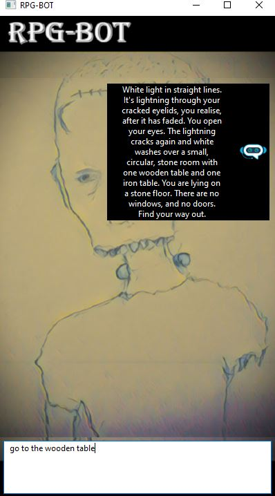

# RPG-BOT-Git
RPG bot with wxWidgets.

This is a first version of a pop-up roleplay game. It is based on code developed by Udacity as part of their C++ course. As part of this course, I worked on this code to produce constructors (default, parameterised, assignment, and move) and destructors, as well as to enable the movement of unique pointers from node to node. I have since adapted it for a roleplaying game which can be played alongside other work.
This code relies on wxWidgets dependencies. Two good videos for how to set these up are:

https://www.youtube.com/watch?v=sRhoZcNpMb4

and

https://www.youtube.com/watch?v=X4va_MeIia0

which both direct you to:

https://www.wxwidgets.org/downloads/

Further versions of this code will need to concentrate on:
1) an exceptions structure.
2) a test suite, including testing the playing logic of the game and increasing the range of sensible responses to each human interaction.
3) a way of capturing nodes within conditional logic so that, say, if a certain item has been picked up certain nodes become available. (At the moment, I am repeating large sections of the node tree, which is a lot of effort and additional programming, which may be reduced by a better understanding and use of the underlying logic in the structure of Udacity's code.)
There will be - no doubt- other improvements you can think of. Any advice or help gratefully received.

All the best,

Toby
